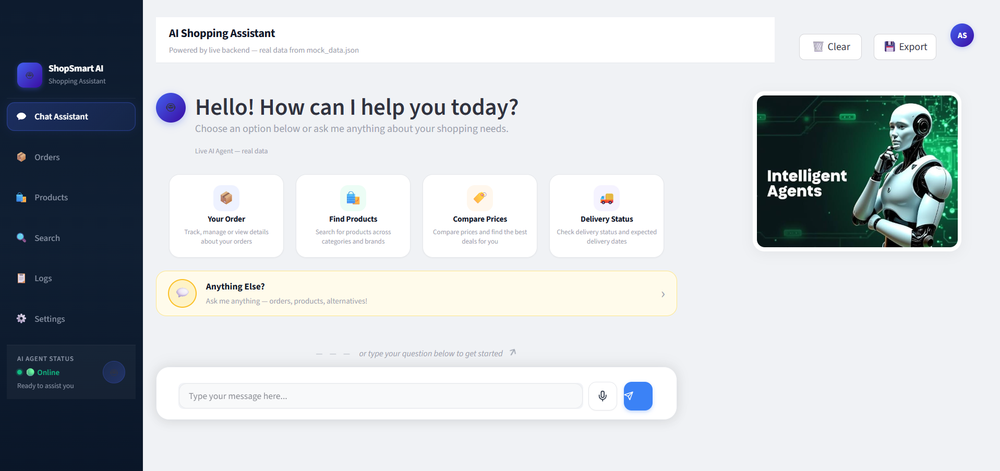

# Mandelbulb
<div align="center">

# 🛒 ShopSmart AI

### Agentic Customer Support Assistant for Online Stores

*Powered by Rule-Based Planning · Google Gemini 2.5 Flash · Streamlit*

---

[](https://python.org)
[](https://streamlit.io)
[](https://ai.google.dev)
[](https://pytest.org)
[](LICENSE)



</div>

---

## 📖 What is ShopSmart AI?

ShopSmart AI is a fully agentic customer support assistant built for an online store. You ask it a question in plain English — it figures out which tools to call, in what order, executes them, and returns a clean, friendly response.

```
"Where is my order ORD-10021?"         →  Fetches order, shows full status + tracking
"Find me wireless headphones"          →  Searches catalog, returns ranked results
"Cheaper alternative to Sony WH-1000XM5?" →  Gets product → searches alternatives
"What did I buy in ORD-10025?"         →  Gets order → gets product → finds similar items
```

---

## 📑 Table of Contents

- [Features](#-features)
- [System Architecture](#-system-architecture)
- [How It Works — Pipeline](#-how-it-works--pipeline)
- [Project Structure](#-project-structure)
- [Tools Reference](#-tools-reference)
- [Tool Chaining Patterns](#-tool-chaining-patterns)
- [Intent Detection Logic](#-intent-detection-logic)
- [Tech Stack](#-tech-stack)
- [Installation](#-installation)
- [Usage](#-usage)
- [Running Tests](#-running-tests)
- [Mock Data](#-mock-data)
- [Assignment Coverage](#-assignment-coverage)

---

## ✨ Features

| Feature | Details |
|---|---|
| 🧠 **Two-Tier Planning** | Fast regex rules (Tier 1) + Google Gemini 2.5 Flash fallback (Tier 2) |
| 🔗 **Multi-Step Tool Chaining** | Up to 3 tools chained in a single question |
| ⚡ **Dynamic Argument Resolution** | Search queries derived at runtime from previous tool outputs |
| 🛡️ **Graceful Error Handling** | Invalid IDs, empty results, unsupported questions — all handled cleanly |
| 💬 **Rich Streamlit UI** | Chat interface with HTML order cards, product cards, search grids |
| 📋 **Structured Logging** | Every plan logged to `planner.log` with method, tools, args, timing |
| 🧪 **Comprehensive Tests** | 5 pytest modules — tools, dispatcher, planner, response builder, end-to-end |
| 🔒 **Never Raises, Never Empty** | `run_agent()` is guaranteed to always return a safe string |

---

## 🏗️ System Architecture

The system follows a strict **four-layer pipeline**. Each layer has exactly one responsibility and never crosses into another layer's domain.

```
┌─────────────────────────────────────────────────────────────────────┐
│                         USER QUESTION (str)                         │
└──────────────────────────────┬──────────────────────────────────────┘
                               │
                               ▼
┌─────────────────────────────────────────────────────────────────────┐
│                    STREAMLIT UI  (streamlit_app.py)                 │
│           Chat interface · Rich HTML cards · Sidebar inspector       │
└──────────────────────────────┬──────────────────────────────────────┘
                               │
                               ▼
┌─────────────────────────────────────────────────────────────────────┐
│                   AGENT BRIDGE  (agent_bridge.py)                   │
│        Calls backend pipeline · Extracts structured AgentResult      │
│             intent · order · products · source · tool_calls          │
└──────────────────────────────┬──────────────────────────────────────┘
                               │
                               ▼
┌─────────────────────────────────────────────────────────────────────┐
│                       PLANNER  (planner.py)                         │
│                                                                     │
│   ┌─────────────────────────┐      ┌──────────────────────────┐    │
│   │    TIER 1 — Regex       │─────▶│   TIER 2 — Gemini LLM    │    │
│   │  Fast · Free · Local    │      │  (only if Tier 1 unsure) │    │
│   └─────────────────────────┘      └──────────────────────────┘    │
│                                                                     │
│         Output →  list[{ step, tool, args, reason }]                │
└──────────────────────────────┬──────────────────────────────────────┘
                               │  execution plan
                               ▼
┌─────────────────────────────────────────────────────────────────────┐
│                    DISPATCHER  (dispatcher.py)                      │
│                                                                     │
│    Validates tools · Resolves placeholders · Executes in order      │
│                                                                     │
│   ┌──────────────┐   ┌───────────────────┐   ┌──────────────────┐  │
│   │  get_order() │   │ search_products() │   │  get_product()   │  │
│   └──────┬───────┘   └────────┬──────────┘   └────────┬─────────┘  │
│          └──────────────────┬─┘──────────────────────┘             │
│                             ▼                                       │
│                       mock_data.json                                │
│                  (15 products · 10 orders)                          │
│                                                                     │
│         Output →  list[{ step, tool, success, data, error }]        │
└──────────────────────────────┬──────────────────────────────────────┘
                               │  results
                               ▼
┌─────────────────────────────────────────────────────────────────────┐
│                RESPONSE BUILDER  (response_builder.py)              │
│    Formats results into polished prose · Never fabricates data      │
│         Output →  str  (customer-friendly response)                 │
└──────────────────────────────┬──────────────────────────────────────┘
                               │
                               ▼
                     RESPONSE RETURNED TO USER
```

> **Key principle:** The planner never calls tools. The dispatcher never formats text. The response builder never sees the original question. Each layer is fully independent and unit-testable.

---

## ⚙️ How It Works — Pipeline

Here is exactly what happens when a user sends a message:

**Step 1 — Input Guard**
`run_agent()` immediately rejects blank or non-string input and returns a helpful prompt asking for a valid question.

**Step 2 — Tier 1 Planning (Regex)**
The planner runs 6 intent detectors in priority order using regex patterns and keyword sets. If any detector fires confidently, the plan is returned instantly — no API call needed.

**Step 3 — Tier 2 Planning (Gemini, if needed)**
If no Tier 1 rule matches, the planner sends the question to **Google Gemini 2.5 Flash** with a structured system prompt. Gemini returns a JSON execution plan. If Gemini fails, an `__unsupported__` sentinel is used.

**Step 4 — Dispatching**
The dispatcher iterates over plan steps. For each step it:
- Validates the tool exists in `TOOL_REGISTRY`
- Resolves any placeholder arguments (e.g. `__product_id_from_order__`) using the previous step's output
- Calls the tool and classifies the result (success / not found / empty / error)
- Passes the result to the next step for chaining

**Step 5 — Response Building**
The response builder inspects the full result list, detects the scenario, and renders a formatted customer-friendly string.

**Step 6 — Logging**
Every planning decision is written to `planner.log` with timestamp, method (regex/LLM), tools called, arguments, and elapsed time.

---

## 📁 Project Structure

```
Mandelbulb/
│
├── run_agent.py            # 🚀 Public entry point:  run_agent(question: str) -> str
├── planner.py              # 🧠 Intent detection & execution plan generation
├── dispatcher.py           # ⚙️  Tool execution & dynamic placeholder resolution
├── response_builder.py     # 💬 Converts raw results → customer-friendly text
├── agent_bridge.py         # 🌉 Streamlit ↔ backend bridge (AgentResult dataclass)
├── streamlit_app.py        # 🖥️  Full chat UI with rich HTML card rendering
│
├── utils.py                # 🔧 Shared helpers: data loading, price/date formatting
├── capture_outputs.py      # 📸 Utility to capture and save agent outputs
├── mock_data.json          # 🗄️  15 products + 10 orders (mock data store)
├── styles.css              # 🎨 Custom Streamlit CSS theme
├── ai_agent.jpg            # 🖼️  Project banner image
├── requirements.txt        # 📦 Python dependencies
├── .env                    # 🔑 API key configuration (GEMINI_API_KEY)
├── planner.log             # 📋 Auto-generated planning execution log
│
├── tools/
│   ├── __init__.py         # TOOL_REGISTRY — maps name → callable
│   ├── get_order.py        # Tool: fetch order by ID
│   ├── get_product.py      # Tool: fetch product by ID
│   └── search_products.py  # Tool: keyword-scored product search
│
└── tests/
    ├── __init__.py              # Test package initialiser
    ├── test_agent.py            # End-to-end run_agent() integration tests
    ├── test_dispatcher.py       # Dispatcher unit tests
    ├── test_planner.py          # Planner intent detection tests
    ├── test_response_builder.py # Response formatting tests
    └── test_tools.py            # Individual tool unit tests
```

---

## 🛠️ Tools Reference

The agent has exactly **3 tools**, registered in `TOOL_REGISTRY`:

### `get_order(order_id: str) → dict | None`
Fetches a complete order by its ID. Returns the full order dict (status, items, pricing, shipping, tracking) or `None` if not found.

```python
get_order("ORD-10021")
# Returns: { order_id, customer, status, items, total, tracking_number, ... }
# Returns: None  (if order doesn't exist)
```

### `search_products(query: str) → list[dict]`
Keyword-scored search across product name, brand, tags, category, subcategory, and description. Returns results sorted by relevance score. Returns `[]` if no match.

```python
search_products("wireless noise-cancelling headphones")
# Returns: [ { product_id, name, price, rating, ... }, ... ]  (ranked list)
# Returns: []  (if no products match)
```

Scoring weights: `name/brand = 4pts`, `tags = 3pts`, `category/subcategory = 2pts`, `description = 1pt`

### `get_product(product_id: str) → dict | None`
Fetches a single product by its ID. Returns full product dict or `None` if not found.

```python
get_product("PROD-001")
# Returns: { product_id, name, price, brand, rating, stock, tags, description, ... }
# Returns: None  (if product doesn't exist)
```

---

## 🔗 Tool Chaining Patterns

The dispatcher supports **up to 3 chained steps**, with later steps receiving data from earlier ones via **placeholder resolution**:

```
Pattern 1 — Direct Order Lookup          (1 step)
  get_order(ORD-XXXXX)

Pattern 2 — Direct Product Detail        (1 step)
  get_product(PROD-XXX)

Pattern 3 — Product Search               (1 step)
  search_products(query)

Pattern 4 — Cheaper Alternative by Name  (2 steps)
  get_product(PROD-XXX)
    └─▶ search_products(__derived_from_product_tags__)
                        ↑ query built from Step 1's tags/category at runtime

Pattern 5 — Cheaper Alternative via Order  (3 steps)
  get_order(ORD-XXXXX)
    └─▶ get_product(__product_id_from_order__)
                    ↑ product_id extracted from Step 1's order items
          └─▶ search_products(__derived_from_product_tags__)
                              ↑ query built from Step 2's tags at runtime

Pattern 6 — Product Details from an Order  (3 steps)
  get_order(ORD-XXXXX)
    └─▶ get_product(__product_id_from_order__)
          └─▶ search_products(__derived_from_product_tags__)
```

> Placeholders like `__derived_from_product_tags__` are resolved by the dispatcher at execution time — the planner **never** hard-codes them.

---

## 🎯 Intent Detection Logic

The planner checks intents in this exact priority order:

| Priority | Intent | What Triggers It |
|:---:|---|---|
| 1 | **Ambiguous** | Both an order ID *and* a product ID present |
| 2 | **Order-Based Details** | Order ID + signals like *"what did I buy"*, *"product in order"* |
| 3 | **Cheaper Alternative** | Budget/alternative keywords + optional order or product reference |
| 4 | **Order Lookup** | Order ID present, or order-related keywords (track, shipped, delivery…) |
| 5 | **Product Detail** | Product ID present, or known product name + detail keywords |
| 6 | **Product Search** | Search/browse keywords or product category terms |
| 7 | **Unsupported → Gemini** | No rule fires → Tier 2 LLM → sentinel if LLM also fails |

Product names (e.g. *"Sony WH-1000XM5"*) are resolved to IDs at import time from a lookup table built from `mock_data.json`, so customers never need to know a product's ID.

---

## 💻 Tech Stack

| Layer | Technology | Purpose |
|---|---|---|
| **Web UI** | Streamlit ≥ 1.55.0 | Chat interface, rich HTML cards, sidebar |
| **AI Planner (Tier 2)** | Google Gemini 2.5 Flash | LLM fallback for ambiguous questions |
| **Language** | Python 3.10+ | Core implementation |
| **Data Store** | `mock_data.json` | 15 products, 10 orders |
| **Config** | python-dotenv | `.env`-based API key management |
| **Testing** | pytest ≥ 9.1.1 | 5 test modules |
| **Styling** | Custom CSS | `styles.css` for Streamlit theme |

---

## 📦 Installation

### Prerequisites
- Python 3.10 or later
- A Google Gemini API key *(optional — agent falls back to regex-only mode without it)*

### Setup

```bash
# 1. Unzip the project
cd Mandelbulb

# 2. Create a virtual environment (recommended)
python -m venv .venv
source .venv/bin/activate          # Windows: .venv\Scripts\activate

# 3. Install dependencies
pip install -r requirements.txt

# 4. Add your Gemini API key to .env
# Open .env and replace the placeholder:
GEMINI_API_KEY="your_actual_api_key_here"
```

**`requirements.txt`**
```
streamlit>=1.55.0
pytest>=9.1.1
python-dotenv
google-genai
```

---

## 🚀 Usage

### Option 1 — Streamlit Web UI *(Recommended)*

```bash
streamlit run streamlit_app.py
```

Opens at `http://localhost:8501` with:
- 🏠 Landing page with example action cards
- 💬 Chat view with rich order/product HTML cards
- 📊 Sidebar showing intent, recent tool calls, and context data
- 📦 Full order browser and product catalog browser

### Option 2 — Python API (Direct)

```python
from run_agent import run_agent

response = run_agent("Where is my order ORD-10021?")
print(response)
```

This calls the agent pipeline directly in Python — useful for testing individual questions or integrating the agent into other scripts.

### Option 3 — Python API

```python
from run_agent import run_agent

# Order tracking
print(run_agent("Where is my order ORD-10021?"))

# Product search
print(run_agent("Find me wireless headphones under $300"))

# Cheaper alternatives (2-step chain)
print(run_agent("Is there a cheaper alternative to the Sony WH-1000XM5?"))

# Product from order (3-step chain)
print(run_agent("What product did I buy in ORD-10025?"))
```

### Option 3 — Example Questions to Try

```
# Order tracking
Where is my order ORD-10021?
Track my package ORD-10026
Is order ORD-10024 cancelled?
What happened to ORD-10027?

# Product search
Find wireless headphones
Show me running shoes
Search for kitchen appliances
Recommend a portable charger

# Product details
Tell me about PROD-001
What are the specs of the Kindle Paperwhite?
How much does the Instant Pot cost?

# Alternatives (chained)
Is there a cheaper alternative to Sony WH-1000XM5?
Find me budget running shoes instead of PROD-007
Cheaper option for the item in my order ORD-10022?

# From order (chained)
What did I buy in order ORD-10025?
Show me the product details for my order ORD-10021
```

---

## 🧪 Running Tests

```bash
# Run all tests
pytest

# Verbose output
pytest -v

# Run a specific module
pytest tests/test_agent.py -v
pytest tests/test_planner.py -v
pytest tests/test_tools.py -v
```

| Test Module | What It Tests |
|---|---|
| `test_tools.py` | `get_order`, `get_product`, `search_products` — valid/invalid/edge cases |
| `test_dispatcher.py` | Placeholder resolution, step chaining, sentinel handling, error propagation |
| `test_planner.py` | All 6 intent detectors — correct tool selection and argument extraction |
| `test_response_builder.py` | Formatted output for every scenario (found, not found, empty, alternatives…) |
| `test_agent.py` | End-to-end `run_agent()` — invariants: never raises, never returns empty string |

---

## 🗄️ Mock Data

The agent works against a local `mock_data.json` file with:

**15 Products** across categories:
- Electronics (headphones, TV, mouse, power bank)
- Footwear (Nike, Adidas running shoes)
- Kitchen & Dining (Instant Pot, Ninja Air Fryer, Vitamix)
- Books & Media (Kindle Paperwhite)
- Toys & Games (LEGO Technic)
- Sports & Outdoors (Hydro Flask)
- Clothing (The North Face jacket)

**10 Orders** covering all statuses:

| Status | Example Order |
|---|---|
| ✅ Delivered | ORD-10021, ORD-10025, ORD-10030 |
| 🚚 Shipped | ORD-10022, ORD-10028 |
| ⏳ Processing | ORD-10023, ORD-10029 |
| ❌ Cancelled | ORD-10024 |
| 🚀 Out for Delivery | ORD-10026 |
| 🔄 Returned | ORD-10027 |

---

## ✅ Assignment Coverage

| Requirement | Status | Implementation |
|---|---|---|
| `run_agent(question: str) -> str` | ✅ | `run_agent.py` |
| `get_order(order_id)` tool | ✅ | `tools/get_order.py` |
| `search_products(query)` tool | ✅ | `tools/search_products.py` |
| `get_product(product_id)` tool | ✅ | `tools/get_product.py` |
| Correct tool selection | ✅ | Planner with 6 intent detectors |
| Multi-step tool chaining | ✅ | Up to 3 chained steps |
| Handle invalid order/product | ✅ | `None` return → friendly message |
| Handle empty search results | ✅ | Empty list → friendly message |
| No raw tool output to user | ✅ | Response builder formats everything |
| No data fabrication | ✅ | Enforced at response builder layer |
| LLM provider integration | ✅ | Google Gemini 2.5 Flash (Tier 2) |
| Tool call logging | ✅ | `planner.log` + `agent_bridge` tool_calls |
| Streamlit web interface | ✅ | `streamlit_app.py` with rich UI |
| Unit tests | ✅ | 5 pytest modules |
| README | ✅ | This document |
| Sample inputs/outputs | ✅ | `INPUT_OUTPUT_EXAMPLES.md` |
| Design decisions doc | ✅ | `PROJECT_DOCUMENTATION.md` |

---

<div align="center">

Made with ❤️ for the Agentic AI Assignment

</div>
